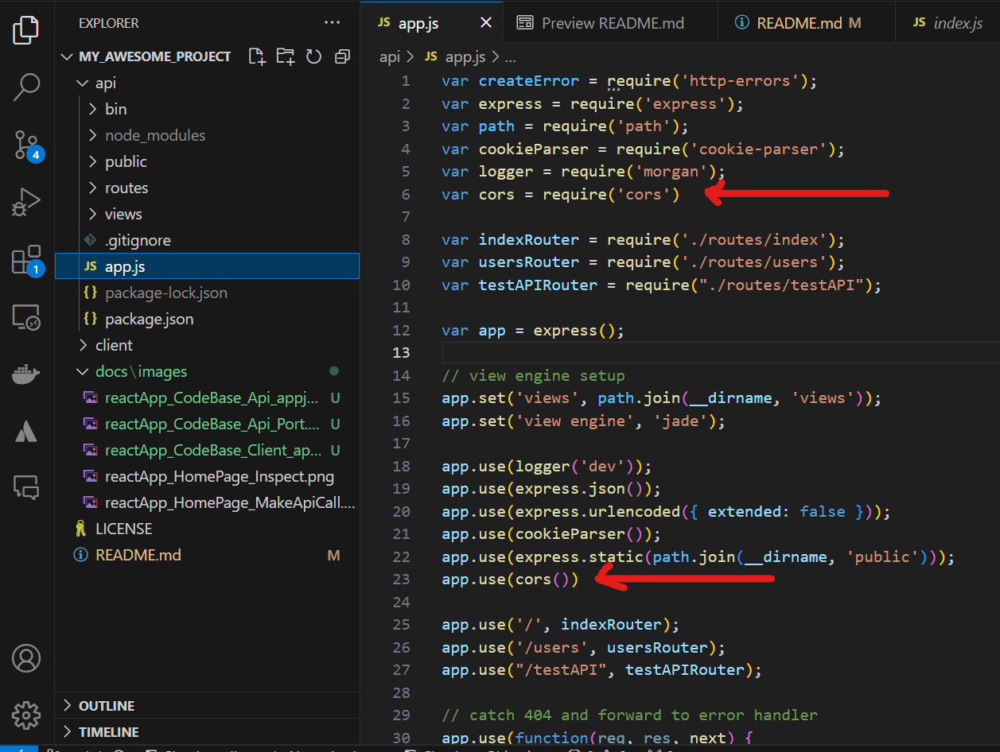

# simple-web-app
It's a simple fullstack web app with backend as expressjs and frontend as reactjs

## How to run it
### To run api (backend)
```bash
# This is a Bash code block
cd api
npm install
npm start #It will start api (backend) at localhost, port 9000
```
### To run client (frontend)
```bash
# This is a Bash code block
cd client
npm install
npm start #It will start client (frontend) at localhost, port 3000
```

#### Go to website, click on inspect


#### Make Api Call


## How to create application

### Create the Main Project directory

In your terminal, navigate to a directory where you would like to save your project. Now create a new directory for your project and navigate into it:

```bash
mkdir mywebApp
cd mywebApp
```

### Create React App

```bash
npx create-react-app client
cd client
npm start
```

Let’s see what I have done:

1. Used npm’s npx to create a react app and named it client.
1. cd(change directory) into the client directory.
1. Started the app.
In your browser, navigate to http://localhost:3000/.

If all is ok, you will see the react welcome page. Congratulations! That means you now have a basic React application running on your local machine. Easy right?

To stop your react app, just press **Ctrl + c** in your terminal.

### Create Express App

Navigate to the root of the folder

```bash
npx express-generator api
cd api
npm install
npm start
```

Let’s see what I have done:

1. Used npm’s npx to install express-generator globally.
1. Used express-generator to create an express app and named it api.
1. cd into the API directory.
1. Installed all dependencies.
1. Started the app.
In your browser, navigate to http://localhost:3000/.

If all is ok, you will see the express welcome page. Congratulations! That means you now have a basic Express application running on your local machine. Easy right?

To stop your react app, just press **Ctrl + c** in your terminal.

### Configuring a new route in the Express API

1. Inside the API directory, go to bin/www and change the port number on line 15 from 3000 to 9000


_my_awesomeproject/api/bin/www

2. On api/routes, create a testAPI.js file and paste this code:
```js
var express = require("express");
var router = express.Router();

router.get("/", function(req, res, next) {
    res.send("API is working properly");
});

module.exports = router;
```
3. On the api/app.js file, insert a new route on line 24:
```js
app.use("/testAPI", testAPIRouter);

module.exports = router;
```
4. Ok, you are “telling” express to use this route but, you still have to require it. Let’s do that on line 9:
```js
var testAPIRouter = require("./routes/testAPI");
```
The only changes are in line 10 and line 27. It should end up something like this:

my_awesomeproject/api/app.js

5. Congratulations! You have created a new route.

If you start your API app (in your terminal, navigate to the API directory and “npm start”), and go to http://localhost:9000/testAPI in your browser, you will see the message: API is working properly.

### Connecting the React Client to the Express API

1. On your code editor, let’s work in the client directory. Install axios
```bash
npm install axios
```
1. On your code editor, let’s work in the client directory. Open app.js file located in my_awesome_project/client/app.js and import axios at the top of file.

```js
import axios from 'axios';
```

1. Here I will use the Fetch API to retrieve data from the API. Just paste this code after the Class declaration and before the render method:

```js
const callAPI = () => {
  axios.get("http://localhost:9000/testAPI").then((data) => {
    //this console.log will be in our frontend console
  console.log(data)
  })
}
```
1. Inside the render method, you will find a <;p> tag. Let’s change it so that it renders the apiResponse:
```js
<button onClick={callAPI}>Make API Call</button>
```

At the end, this file should look something like this:


I know!!! This was a bit too much. Copy paste is your friend, but you have to understand what you are doing. Let’s see what I did here:

1. On lines 6 to 9, we inserted a constructor, that initializes the default state.
1. On lines 11 to 16, we inserted the method callAPI() that will fetch the data from the API and store the response on this.state.apiResponse.
1. On lines 18 to 20, we inserted a react lifecycle method called componentDidMount(), that will execute the callAPI() method after the component mounts.
1. Last, on line 29, I used the <;p> tag to display a paragraph on our client page, with the text that we retrieved from the API.

#### What the heck!! CORS ?

Oh yeah, baby! We are almost done. But if we start both our apps (client and API) and navigate to http://localhost:3000/, you still won't find the expected result displayed on the page. If you open chrome developer tools, you will find why. In the console, you will see this error:

This is simple to solve. We just have to add CORS to our API to allow cross-origin requests.

1. In your terminal navigate to the API directory and install the CORS package:
```bash
npm install --save cors
```
1. On your code editor go to the API directory and open the my_awesome_project/api/app.js file.
1. In our index.js, we'll require and use that. Your index.js will look like this:



Nooow if we run our React app with npm run start in the client terminal (after starting our server back up in the server terminal), and click our button...

It works!